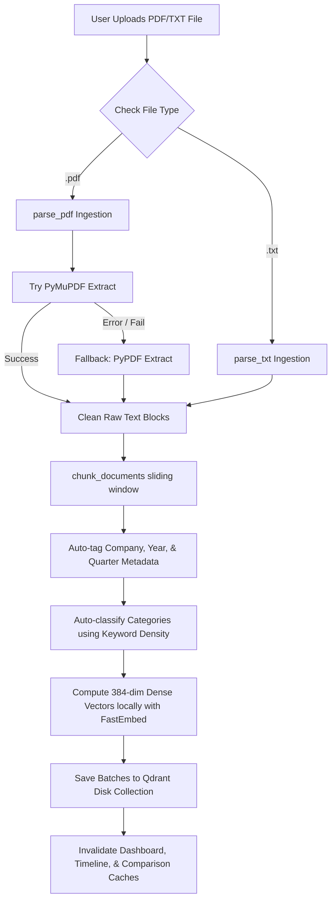
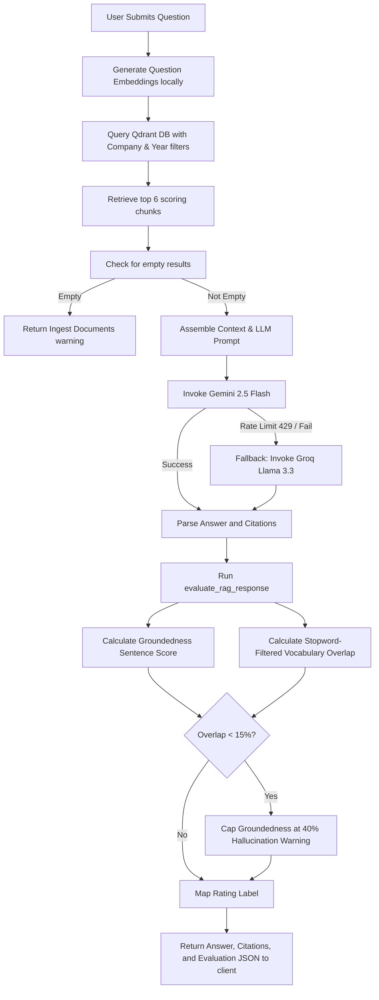
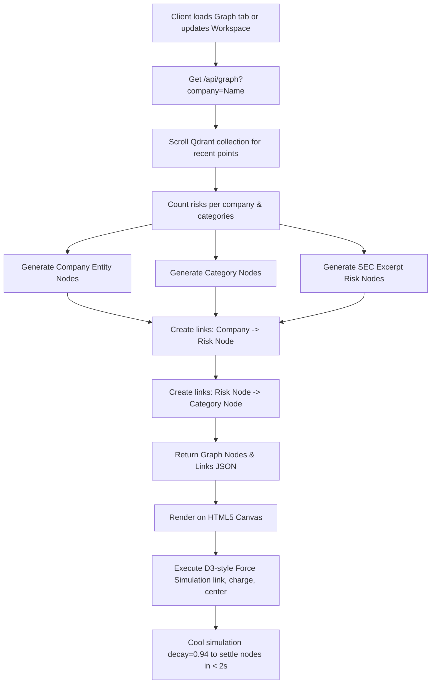
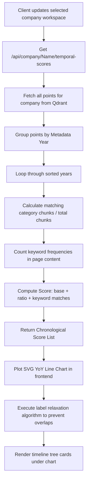

# System Workflows & Architecture Diagrams

This document details the step-by-step workflow of the major pipelines in RiskLens AI: Ingestion, Retrieval (RAG), Graph Explorer, and Temporal Scoring.

---

## 1. Document Ingestion Workflow

This workflow represents the data pipeline from uploading a raw PDF/TXT document to storing semantic vectors in Qdrant.

---

## 2. Retrieval & RAG QA Workflow

This workflow represents the conversational search query pipeline executing semantic vector matches, generating answers, and evaluating response quality.

---

## 3. Knowledge Graph Construction Workflow

This workflow illustrates how the 2D Force-Directed Network Graph compiles nodes and links from Qdrant scroll requests.

---

## 4. Chronological Timeline Scoring Workflow

This workflow represents how the YoY risk trends are computed and plotted over time.

